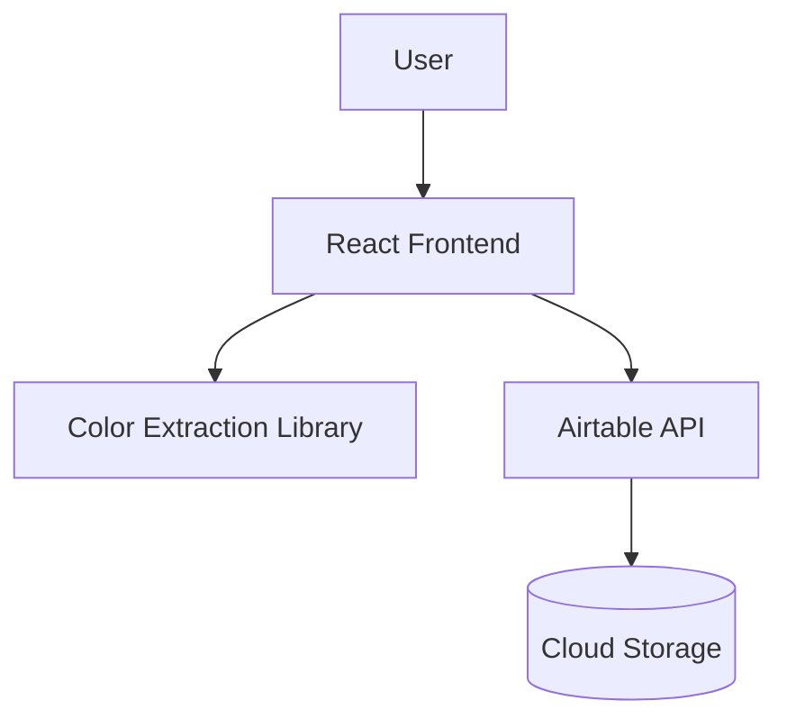

# ColorPalette Generator

A minimalist web application that extracts colour palettes from images and allows users to save and manage their favourite combinations.

Built with React and integrated with Airtable for persistent storage.

---

## Product Overview

ColorPalette Generator helps users quickly extract visually coherent colour palettes from images and store them for inspiration, design reference, or creative workflows.

It focuses on:

- Fast palette extraction from images
- Simple visual exploration of colour combinations
- Persistent saving of favourite palettes

---

## Preview

### Main Generator Interface

Users can:

- Paste an image URL
- Generate a 5-colour palette
- Save palettes to favourites

---

## Core Features

### Image-Based Palette Extraction

Generate 5 dominant colours from any image URL.

### ColorThief Integration

Uses the ColorThief library to extract accurate dominant colours from images.

### Save & Manage Palettes

Save generated palettes and manage them in a favourites view.

### Persistent Storage

All saved palettes are stored using Airtable.

### Responsive UI

Optimised for desktop, tablet, and mobile devices.

---

## Tech Stack

Frontend  
React 18, Vite, React Router

State Management  
React Query, React State

Colour Extraction  
ColorThief

Backend Integration  
Airtable API

Styling  
CSS Modules

---

## System Overview

---

## Key Components

- ImageInputForm: Handles image URL input
- PaletteDisplay: Displays extracted colours
- PaletteCard: Saved palette UI component
- SaveForm: Handles saving palette metadata
- Navbar: Navigation between generator and favourites

---

## My Contribution

- Built full React application from scratch using Vite
- Integrated ColorThief for image-based colour extraction
- Designed and implemented UI for palette generation and saving
- Connected Airtable API for persistent data storage
- Built reusable components for modular UI structure

---

## Product Thinking

- Designed for fast creative exploration of colour palettes
- Reduced friction in generating and saving visual inspiration
- Focused on simplicity and immediate feedback
- Prioritised visual clarity over feature complexity

---

## Engineering Decisions

- Used React Query for efficient data fetching and caching
- Separated UI into modular, reusable components
- Used Airtable as a lightweight backend to reduce infrastructure complexity
- Optimised for responsive design across devices

---

## Challenges Solved

- Handling image CORS restrictions in palette extraction
- Managing state between generated and saved palettes
- Ensuring consistent colour formatting across components

---

## Key Learnings

- Working with third-party APIs (Airtable, ColorThief)
- Managing frontend state in data-driven UI
- Designing simple but functional product interfaces
- Integrating external services into a React architecture

---

## Future Improvements

- Drag-and-drop image upload
- Downloadable palette export (CSS / PNG)
- User authentication system
- Palette tagging and search functionality
